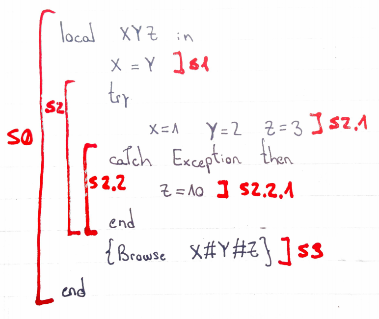

# Ej. 3.6) 

## Código:

## Análisis

( < S0, { } > ) <--  

σ  = { x1, y1, z1 }   

⇓⇓⇓⇓⇓⇓⇓⇓⇓⇓⇓⇓⇓⇓⇓  

( < S1, { E1 } > ) <--  
( < S2, { E1 } > )  
( < S3, { E1 } > )  

σ  = { x1 = y1, z1 }  
E1 = { X->y1, Y->y1, Z->z1 } 

⇓⇓⇓⇓⇓⇓⇓⇓⇓⇓⇓⇓⇓⇓⇓ 

( < S2, { E1 } > )  <--  ( Try block )  
( < S2.1, { Et1 } > )  
( < S2.2, { Ec } > ) ( Catch block )   
( < S3, { E1 } > )  

σ  = { x1 = y1 , z1 }  
E1 = { X->y1, Y->y1, Z->z1 }  

⇓⇓⇓⇓⇓⇓⇓⇓⇓⇓⇓⇓⇓⇓⇓  

( < S2.1, { Et1 } > )  <--  (se ejecuta sólo la primer instrucción correctamente, se llega a un raise Exception)  
( < S2.2, { Ec } > ) ( Catch block )   
( < S3, { E1 } > )  

σ  = { x1 = y1 = 1, z1 }  
Et1 = E1 + { Exception }
Ec = {}
⇓⇓⇓⇓⇓⇓⇓⇓⇓⇓⇓⇓⇓⇓⇓  
/* Se llega a un bloque catch */  

( < S2.2, { E1 } > ) ( Catch block ) <--  
( < S2.2.1, { Ec } > )  
( < S3, { E1 } > )

σ  = { x1 = y1 = 1, z1 }  
Et1 = E1 + { Exception }

⇓⇓⇓⇓⇓⇓⇓⇓⇓⇓⇓⇓⇓⇓⇓  

( < S2.2.1, { Ec + { Exception -> Et1(Exception)} } > ) <--  
( < S3, { E1 } > )

σ  = { x1 = y1 = 1, z1 = 10 }  
Et1 = { X->y1, Y->y1, Z->z1, Exception }  
Ec = {}  

⇓⇓⇓⇓⇓⇓⇓⇓⇓⇓⇓⇓⇓⇓⇓  
    
( < S3, { E1 } > ) <--  

σ  = { x1 = y1 = 1 , z1 = 10 }  
E1 = { X->y1, Y->y1, Z->z1 }

⇓⇓⇓⇓⇓⇓⇓⇓⇓⇓⇓⇓⇓⇓⇓  

σ  = { x1 = y1 = 1 , z1 = 10 }